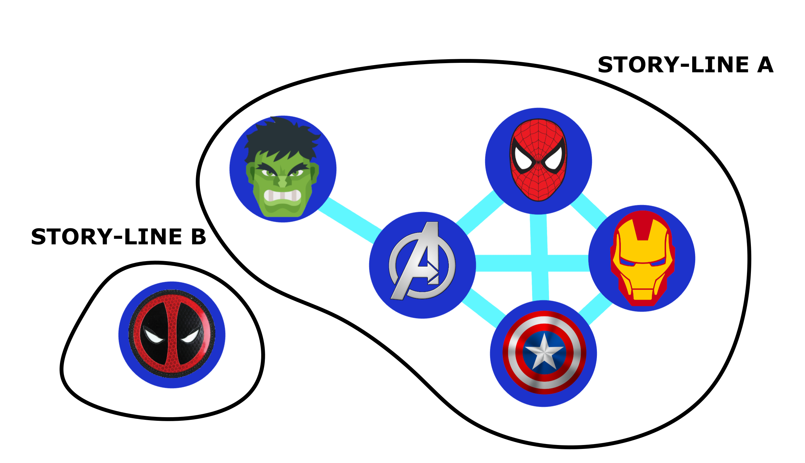
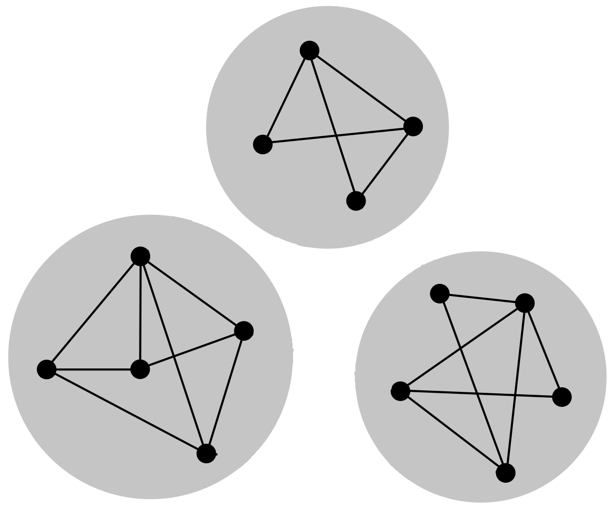

# Storyline Segmentation

A java based implementation that uses graph representation and island (connected component) identification to process data about comic book characters (Marvel, Naruto etc) and segment them into independent storylines.

Part of Assignmet 4 of COL106 course 2020.

## Problem statement

We are given a set of nodes and a set of edges, such that the nodes are individual characters and two nodes share an edge if these two charcters have ever occured (or even mentioned) in the same movie or episode. This data is provided in the form of csv files of nodes and edges.

Using this data, we are to calculate relevant statistics like the average number of co-occurrrences and rankings of the characters in order of their co-occurrences, and then segment out the characters' stories into independent storylines. 

For example, consider an example about characters from the Marvel Cinematic Universe (MCU). In Captain America (the First Avenger), there was no role played by Thor or Iron Man. So, when it was released, Captain America had a storyline that was independent of the storyline of Thor and Iron man. But, when the Avengers was released, their storylines became dependent.

### Independent Storyline

We define an independent storyline as a set of characters, whose origins, past history and any interaction is only limited to other characters in the set. 

   
	Here, all avengers heroes are in the same storyline, while deadpool is in an independent storyline

Thus, independent storylines of a Comic Universe (marvel, naruto etc.) can be considered as separate movies or series of their own.

## Solution

Relevant data about the individual characters is taken in the form of csv files. This data is first parsed, and stored as an undirected graph. The undirected graph data structure is able to represent the relations between characters needed. Each node in the graph represents a chracter, and each edge between two nodes represent the co-occurrence relation between the two corresponding characters. 

After creating the graph, some important statistics are extracted. Some of these are:
1. **Average co-occurrences**: 
	This is the average number of times a character appears in a movie/episode that is the core of some other character. This value is important, as it demonstrates how inter-connected a comic Universe is. If the average number of co-occurrences is very high, it means all the characters are closely connected with each other, giving regular appearences in others' movies/episodes. 

2. **Co-occurrence rankings**:
	This tells us relative rankings of each character in terms of their co-occurrences. A character with a higher rank will probably be a more famous or important character. For example, Nick Fury appears in almost all Marvel movies.

Finally, the each independent storyline is identified. 

### Identifying Independent Storylines

If two characters are in two different storylines, then they must not have a co-occurrence with any third character. Thus, in the graph representation, there should not be a path between the two nodes corresponding to the characters. Conversely, if there is a path from one node to another, then the charcters corresponding to these nodes need to be in the same storyline. Thus, with the graph representation ready, we effectively need to find islands of connected nodes (connected components). In each connected component, all the nodes have paths to and from each other, and any two nodes from two different components do not have a path connecting them. Thus, in terms of the graph representation, an independent storyline is simply a **connected component**.

   
  Connected Components

So, the problem reduces to finding the connected components of the graph representation already obtained. Performing **DFS** (Depth-First-Search) on the graph starting from any node would give all nodes connected with it. Thus, this will give a single connected component within the graph and containing that starting node. Chosing another node from the remaining nodes and performing DFS again would give another connected component. Repeating this process untill all nodes have been covered would lead to the identification of all of the connected components in the graph, and thus, all of the independent storylines in the comic Universe. 

## Instructions for use

To test the code with sample marvel data; first clone the repo, then go inside the repo directory and run the following commands in a terminal:
~~~
make build 
make average
make rank
make segment
~~~

To test the code with custom data; first clone the repo, then go inside the repo directory and add the nodes' and edges' csv files in the data directory. Finally, run the folowing commands with the paths to these csv files:

~~~
make build 
java StoryLineSegmentor <nodes file path> <edges file path> average
java StoryLineSegmentor <nodes file path> <edges file path> rank
java StoryLineSegmentor <nodes file path> <edges file path> independent_storylines_dfs
~~~

## Sample Outputs

The sample outputs obtained for the sample marvel data currently in the repo can be found here: [average](data/average.txt), [rankings](data/rankings.txt) and [storylines](data/storylines.txt).
